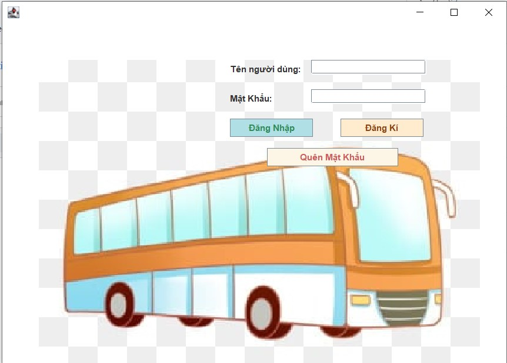
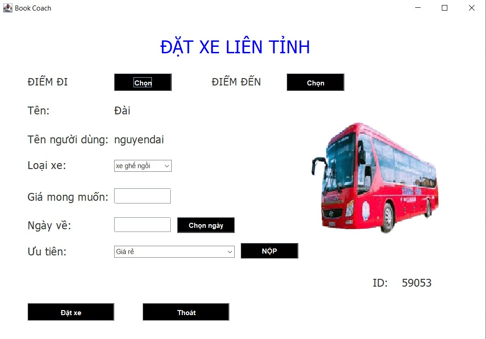

# Long distance bus ticket booking application

This is a Java Swing-based application for booking long-distance rides between provinces in Vietnam. The application provides a convenient way for users to book rides, select their desired destinations, and manage their bookings efficiently.

## Features

- User Registration and Login: Users can create an account or login with their existing credentials to access the application.
- Province Selection: Users can select their departure and destination provinces from a comprehensive list of provinces in Vietnam.
- Ride Booking: Users can book a ride by specifying their preferred departure date, time, and the number of passengers. The application will search for available rides based on the selected provinces and display the options to the user.
- Ride Details: Users can view detailed information about each available ride, including the departure and arrival times, the vehicle type, and the fare.
- Booking Management: Users can manage their bookings, including viewing their upcoming and past rides, canceling bookings if necessary, and reviewing their booking history.
- Payment Integration: The application integrates with a secure payment gateway, allowing users to make online payments for their rides.
- User Profile: Users can update their profile information, including their contact details and preferences.
- Optimal Route Recommendation: The application utilizes an advanced algorithm to find the shortest route between provinces, considering factors such as distance and price. This allows us to recommend the top 5 most suitable rides for customers based on their preferences for either price or proximity.

## Installation

To run the application locally, follow these steps:

1. Ensure that you have Java Development Kit (JDK) installed on your system.
2. Clone the repository to your local machine.
3. Open the project in your preferred Java IDE (e.g., IntelliJ IDEA, Eclipse).
4. Build the project to resolve dependencies and compile the source code.
5. Run the application by executing the main Java class.

    

   
## Usage

Once the application is running, follow these steps to use the ride booking functionality:

1. Register for a new account or login with your existing credentials.
2. Select your departure and destination provinces from the provided dropdown menus.
3. Choose your preferred departure date, price or distance
4. Click on the "NỘP" button to find available rides based on your selections.
5. View the list of available rides and select the one that suits your preferences.
6. Review the ride details, including the departure and arrival times, the vehicle type, and the fare.
7. Proceed to book the ride and make the payment using the integrated payment gateway.
8. Once the booking is confirmed, you can view and manage your bookings in the "XEM LỊCH SỬ ĐÃ ĐẶT" section.

    
  
## Contributing

We welcome contributions to enhance the functionality and usability of this application. If you would like to contribute, please follow these guidelines:

1. Fork the repository and create a new branch for your feature or bug fix.
2. Make your changes and ensure that the code follows the project's coding conventions.
3. Write unit tests for your changes to maintain code quality.
4. Submit a pull request, describing the changes you have made and their purpose.
5. Your pull request will be reviewed, and any additional feedback or changes required will be communicated through the pull request discussion.

## License

This project is licensed under the [MIT License](LICENSE.md).

## Contact

If you have any questions or suggestions regarding this application, please feel free to contact the development team at [nguyenvandai_t66@hus.edu.vn]

Thank you for using our Ride Booking Application! We hope you have a pleasant experience.
